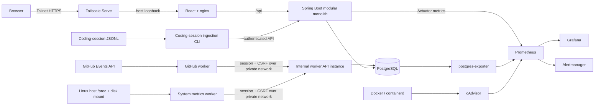
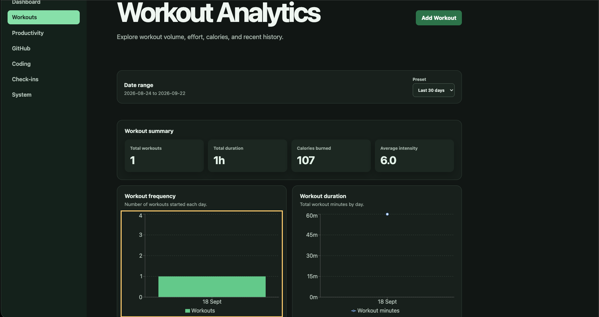
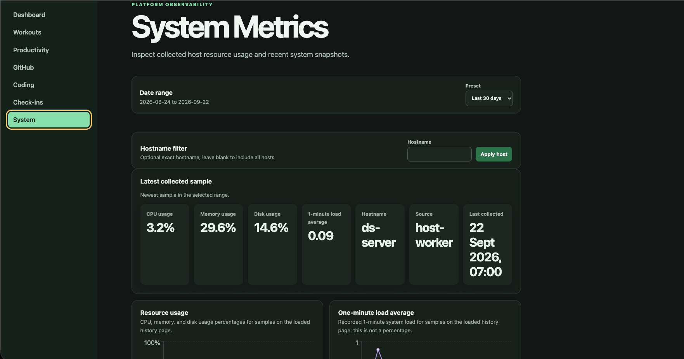
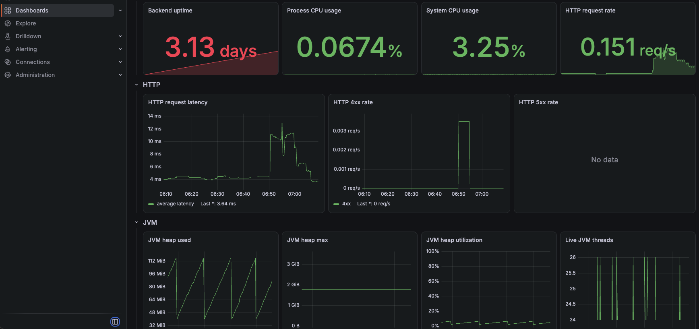
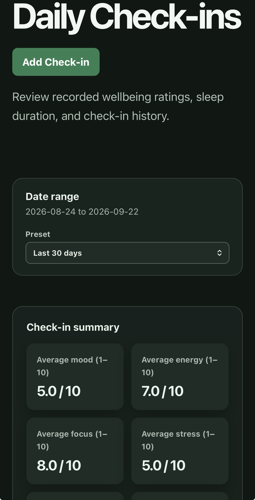

# Lyftix

[](https://github.com/DanielChioma/lyftix/actions/workflows/ci.yml)

Lyftix is a self-hosted personal analytics platform that brings workout, GitHub, coding-session, daily check-in, and host-system data into one authenticated dashboard. It combines a Spring Boot API, a React application, scheduled Python ingestion workers, PostgreSQL, and a containerized monitoring stack.

The project was built to replace disconnected activity logs with one private system that can answer practical questions across domains: how training changes over time, how coding and GitHub activity align, and how subjective energy, mood, stress, and sleep relate to daily output. The application deliberately presents correlations and comparisons rather than claiming causation.

## At a glance

- Self-hosted personal analytics platform with v1 running in a private production environment.
- React and nginx frontend backed by a Spring Boot modular monolith, PostgreSQL, and Python ingestion workers.
- Unified workout, GitHub activity, coding-session, daily check-in, cross-domain, and host-system analytics.
- Production-oriented session security, Docker Compose deployment, automated testing, operational observability, and private HTTPS access through Tailscale.

## Current capabilities

- Session-authenticated dashboard with CSRF protection and owner-only access.
- Workout creation, history, pagination, sorting, date filtering, KPI summaries, and charts.
- GitHub activity ingestion with pagination, durable checkpoints, duplicate protection, history, and analytics.
- Coding-session ingestion from JSONL, with history and duration/language/project analytics.
- Daily check-in creation with mood, energy, stress, sleep, and notes; one check-in per date.
- Cross-domain daily, weekly, monthly, and productivity summaries.
- Host-system metrics for CPU, memory, disk, load average, and uptime.
- Responsive light and dark interfaces for desktop and mobile layouts.
- OpenAPI documentation, structured production logs, health checks, Prometheus metrics, provisioned Grafana dashboards, and alert rules.
- Docker Compose deployment with isolated worker and database networks and loopback-only browser-facing ports.

## Architecture

Lyftix is a modular monolith: one Spring Boot application owns the domain model, business rules, API, authentication, persistence, and analytics queries. Domain packages remain separated by responsibility without introducing distributed-service complexity. Python workers are independent ingestion processes, but they use the authenticated HTTP API rather than accessing PostgreSQL directly.

For component responsibilities and data flows, see the [application architecture](docs/architecture/application-architecture.md).



There are two intentionally separate concerns:

1. **Personal analytics** flow through the domain API into PostgreSQL and are presented in the React dashboard.
2. **Operational observability** flows from Spring Boot Actuator, postgres-exporter, and cAdvisor into Prometheus, Grafana, and Alertmanager.

The browser-facing backend keeps secure session cookies enabled in production. Scheduled workers use a second, unexposed Spring Boot instance on isolated `worker_api` and `worker_db` networks so normal HTTP client cookie handling works over private Docker HTTP. That instance shares the same application and database, has no published port, and does not receive bootstrap credentials.

## Technology stack

| Area | Technology | Role |
| --- | --- | --- |
| Backend | Java 21, Spring Boot 4.0.6 | REST API, domain logic, analytics, authentication, and health endpoints |
| Persistence | Spring Data JPA, PostgreSQL 16 | Relational storage and query layer |
| Schema | Flyway | Versioned schema ownership; Hibernate validates rather than creates the schema |
| API documentation | Springdoc OpenAPI 3.0.3 | OpenAPI JSON and Swagger UI |
| Frontend | React 19, TypeScript 6, Vite 8 | Authenticated single-page application |
| Client data | TanStack Query | Server-state fetching, caching, invalidation, and mutation handling |
| Visualization | Recharts | Domain and cross-domain analytics charts |
| Workers | Python 3.12, httpx, pydantic-settings, psutil | Scheduled GitHub and host-metric ingestion plus JSONL coding-session import |
| Testing | JUnit, Mockito, Spring Boot Test, Testcontainers, Vitest, Testing Library, pytest | Unit, integration, API, UI, worker, and configuration coverage |
| Operations | Docker Compose, nginx, Prometheus, Grafana, Alertmanager, postgres-exporter, cAdvisor | Deployment, reverse proxying, metrics, dashboards, and alert evaluation |

## Data flows

### Browser requests

nginx serves the compiled React application and proxies `/api/*` to the backend over the Compose network. In production, Tailscale Serve terminates TLS and forwards to nginx through a loopback-only host publication. nginx preserves the browser-facing authority and applies the configured public scheme so Spring can reconstruct the original request correctly for strict same-origin checks.

The frontend first obtains a CSRF token, then logs in to a server-side Spring Security session. Protected requests send browser credentials and the CSRF header where required. TanStack Query refetches or invalidates affected domain and analytics data after successful mutations.

### Ingestion workers

- **GitHub:** fetches public-event pages from the GitHub API, maps supported events, posts them to Lyftix, and advances a checkpoint only after safe processing. The checkpoint lives in a named Docker volume in production.
- **System metrics:** reads explicitly mounted, read-only Linux `/proc` inputs for host CPU, memory, load, and uptime. It measures a dedicated read-only directory on the host root filesystem for disk capacity and uses an explicitly configured hostname.
- **Coding sessions:** parses a configured JSONL file and submits sessions through the backend API. Lyftix does not currently perform automatic IDE activity capture.

Workers authenticate with the same session-and-CSRF contract as other API clients. Credentials and GitHub tokens are supplied at runtime and are not baked into images.

### Persistence and analytics

Flyway migrations define tables, constraints, indexes, audit columns, and uniqueness rules for users and all analytics domains. JPA mappings use `ddl-auto=validate`. API date filtering uses explicit UTC boundaries, including start-inclusive/end-exclusive ranges where calendar-day accuracy matters. Analytics endpoints aggregate data in the backend and return purpose-built record DTOs to the frontend.

## Security model

- One database-backed owner role and password hashing through Spring Security's delegating encoder.
- Server-side sessions with session-fixation protection and `HttpOnly`, `SameSite=Lax` cookies.
- Secure browser session cookies enabled by default in the production profile.
- Cookie-based CSRF protection for state-changing requests.
- Explicit, credentialed CORS origins; no wildcard-origin configuration.
- Consistent JSON authentication, authorization, validation, and domain-error responses.
- Frontend and Grafana host publications bound to `127.0.0.1`; backend, database, metrics services, exporters, cAdvisor, and worker API have no published host ports.
- Internal worker/database network separation: workers cannot join the database network or access PostgreSQL directly.
- Non-root runtime users in the backend, frontend, and worker images.
- Host metrics use narrow read-only mounts rather than privileged mode, host PID mode, a Docker socket, or a host-root mount.
- Secrets are runtime configuration. Private environment and secret files are ignored by Git.

## Observability

The production profile emits structured Logstash-compatible JSON logs and attaches correlation IDs to requests and error responses. Spring Boot Actuator exposes health and Prometheus endpoints. Prometheus also scrapes PostgreSQL through postgres-exporter and container metrics through cAdvisor's Docker/containerd integration.

Grafana is provisioned with backend, PostgreSQL, and container-overview dashboards. Alert rules cover backend availability and resource use, HTTP 5xx responses, PostgreSQL health, and exporter availability. The checked-in Alertmanager configuration currently routes alerts to a discard receiver, so external notifications require deployment-specific receiver configuration.

## Testing strategy

The repository uses layered tests rather than relying on a single end-to-end suite:

- Service unit tests isolate business rules with JUnit and Mockito.
- Spring Boot integration tests use Testcontainers PostgreSQL, run Flyway normally, validate JPA mappings, and exercise authentication, validation, persistence, analytics, OpenAPI, logging, and API behavior.
- Frontend tests use Vitest and Testing Library for auth boundaries, forms, routing, queries, responsive behavior, and domain dashboards.
- Worker tests use pytest for configuration, authentication, clients, parsers, mapping, checkpointing, scheduling, and host `/proc` calculations.
- Infrastructure tests statically inspect resolved Compose and nginx behavior to protect network exposure, proxy trust, secrets, monitoring, and container configuration.

Run the main suites from the repository root. Each component group uses a subshell,
so completing one group does not change the working directory for the next:

```bash
# Backend (Docker is required for Testcontainers)
(
  cd backend
  ./mvnw test
)

# Frontend
(
  cd frontend
  npm ci
  npm run lint
  npm test
  npm run build
)

# Workers
(
  cd workers
  python3.12 -m venv .venv
  . .venv/bin/activate
  python -m pip install -e '.[dev]'
  pytest
  ruff check .
)

# Infrastructure regression tests
(
  cd infrastructure
  python3 -m unittest discover -s tests -p 'test_*.py'
  docker compose config --quiet
  docker compose --profile workers config --quiet
)
```

## Production deployment

Lyftix v1 is deployed on a self-hosted Ubuntu Linux HP server with Docker Compose. Remote application access remains private to a Tailscale tailnet:

- Tailscale Serve terminates HTTPS for the frontend.
- The frontend's nginx publication is loopback-only and reverse-proxies API requests to the internal backend service.
- Grafana is also loopback-only and is exposed remotely only through deliberate Tailscale Serve configuration.
- PostgreSQL, Spring Boot, Prometheus, Alertmanager, exporters, cAdvisor, and the worker API remain internal to Docker networking.
- PostgreSQL, Prometheus, Grafana, Alertmanager, and GitHub worker state use named volumes.
- Compose health checks gate backend startup on PostgreSQL readiness, while Prometheus remains independent so it can observe backend downtime.

This repository defines the containers and Compose topology; Tailscale Serve configuration and secret material remain host-managed concerns.

For ingress, service exposure, and trust boundaries, see the [production topology](docs/architecture/production-topology.md).

## Repository structure

```text
lyftix/
├── backend/                 Spring Boot API, domain packages, migrations, and tests
├── frontend/                React/Vite application, nginx runtime, and UI tests
├── workers/                 Python ingestion package, container, and pytest suite
├── infrastructure/
│   ├── docker-compose.yml   Production-oriented service topology
│   ├── prometheus/          Scrape configuration and alert rules
│   ├── alertmanager/        Alert routing configuration
│   ├── grafana/             Provisioned datasource and dashboards
│   ├── secrets/             Ignored runtime secret-file location
│   └── tests/               Infrastructure regression tests
└── README.md
```

## Local development

Run each numbered component command from the repository root in its own terminal.
This keeps the long-running backend and frontend processes independent and makes
each documented `cd` path unambiguous.

### Prerequisites

- Java 21
- Node.js 22 and npm
- Python 3.12
- Docker Engine with Docker Compose

### 1. Start a development PostgreSQL instance

The hardened production Compose topology intentionally does not publish PostgreSQL. A disposable development container can provide the port expected by the backend's default configuration:

```bash
docker run --name lyftix-postgres-dev \
  -e POSTGRES_DB=lyftix \
  -e POSTGRES_USER=lyftix \
  -e POSTGRES_PASSWORD=choose-a-local-password \
  -p 127.0.0.1:5435:5432 \
  -d postgres:16
```

If a development database already exists, instead supply its `DB_HOST`, `DB_PORT`, `DB_NAME`, `DB_USERNAME`, and `DB_PASSWORD`. Flyway applies the schema when the application starts.

### 2. Run the backend

```bash
cd backend
DB_HOST=localhost \
DB_PORT=5435 \
DB_NAME=lyftix \
DB_USERNAME=lyftix \
DB_PASSWORD=choose-a-local-password \
LYFTIX_AUTH_BOOTSTRAP_USERNAME=owner \
LYFTIX_AUTH_BOOTSTRAP_PASSWORD=choose-a-local-owner-password \
./mvnw spring-boot:run
```

Bootstrap credentials create the owner only when no user exists; leave them unset after initial creation. Local endpoints include:

- API health: `http://localhost:8080/api/health`
- Swagger UI: `http://localhost:8080/swagger-ui/index.html`
- OpenAPI JSON: `http://localhost:8080/v3/api-docs`

### 3. Run the frontend

```bash
cd frontend
npm ci
npm run dev
```

`frontend/.env.example` points the Vite client at `http://localhost:8080`. The development UI is served at `http://localhost:5173`, which is also the backend's default allowed CORS origin.

### 4. Run workers locally

Lyftix workers read configuration from process environment variables. Set up the
local package and create a private environment file from the example:

```bash
cd workers
python3.12 -m venv .venv
. .venv/bin/activate
python -m pip install -e '.[dev]'
cp .env.example .env
```

Replace the placeholders and configure the values needed by the worker being run.
For `coding-sessions`, `CODING_SESSIONS_INPUT_PATH` must reference an existing,
readable JSON Lines (JSONL) file. Copying `.env` alone does not load it; export its
values into the current shell before running the desired command:

```bash
set -a
. ./.env
set +a

lyftix-worker github
lyftix-worker coding-sessions
lyftix-worker system-metrics
```

Each command requires only its relevant configuration. Scheduled variants are
`github-schedule` and `system-metrics-schedule`. Local defaults collect metrics for
the process environment; production host collection requires the explicit read-only
mounts and settings in `infrastructure/docker-compose.yml`.

### Full Compose deployment

The full topology requires runtime environment values for PostgreSQL, allowed CORS origins, worker credentials, GitHub access, host-metric identity, and the Grafana initial-admin secret file. From the repository root, copy the public environment template, replace its required and deployment-specific placeholders, and create the Grafana initial-admin password secret file separately as documented in `infrastructure/grafana/README.md`:

```bash
cd infrastructure
cp .env.example .env
docker compose config --quiet
docker compose --profile workers config --quiet
docker compose --profile workers up -d --build
```

For production host disk metrics, create the dedicated directory documented in `workers/README.md`. A fresh Grafana data volume also requires an initial-admin password file; see `infrastructure/grafana/README.md`. Never commit `.env` files, tokens, passwords, or generated state.

## Screenshots

### Workout Analytics

Persisted workouts drive KPI summaries, date-filtered history, charts, and workout analytics.



### System Metrics

Lyftix's Linux host-metrics worker ingests CPU, memory, disk, and load data for historical system analysis.



### Grafana Backend Overview

Prometheus and Grafana expose production backend, Java virtual machine (JVM), and HTTP telemetry.



### Daily Check-ins mobile

The responsive React interface presents wellbeing check-ins and analytics on a mobile viewport.



## Engineering decisions and lessons

- **Calendar boundaries need explicit semantics.** UTC start-inclusive/end-exclusive ranges avoid sub-millisecond end-of-day gaps and accidental inclusion of the following day.
- **Database constraints remain the concurrency-safe authority.** API-level conflict responses translate duplicate-key failures without replacing unique constraints with race-prone pre-checks.
- **Browser and worker sessions have different transport contexts.** Keeping a private worker API instance permits ordinary HTTP client cookie behavior without weakening secure browser cookies.
- **Reverse-proxy trust must be deployment-defined.** Preserving the incoming authority and explicitly configuring the public scheme is safer than deriving HTTPS from a hostname or trusting arbitrary forwarded headers.
- **Container metrics are not automatically host metrics.** The host collector uses explicit `/proc` inputs, consecutive CPU samples, a configured hostname, and a selected host filesystem mount to avoid mixed namespace data.
- **Observability must not depend on application health.** Prometheus starts independently and can therefore detect a stopped or unhealthy backend.
- **Persistent secrets and bootstrap secrets are different.** Grafana's initial password file affects fresh data volumes; changing or removing it does not rewrite an existing persisted admin password.

## Known limitations and future work

- Configure a real Alertmanager notification receiver; the repository currently discards routed alerts.
- Replace file-based coding-session import with an intentionally designed capture integration rather than inferring IDE activity.
- Add user-management and recovery workflows if Lyftix moves beyond its current single-owner deployment model.
- Potential future data sources include wearable/fitness integrations such as Amazfit and storage-health telemetry for the self-hosted server, subject to stable APIs and least-privilege access.

## Project status

Lyftix v1 is complete and running in a private self-hosted production environment. The repository is maintained as a personal platform and engineering portfolio project; future work is incremental rather than a prerequisite for the current system to operate.
