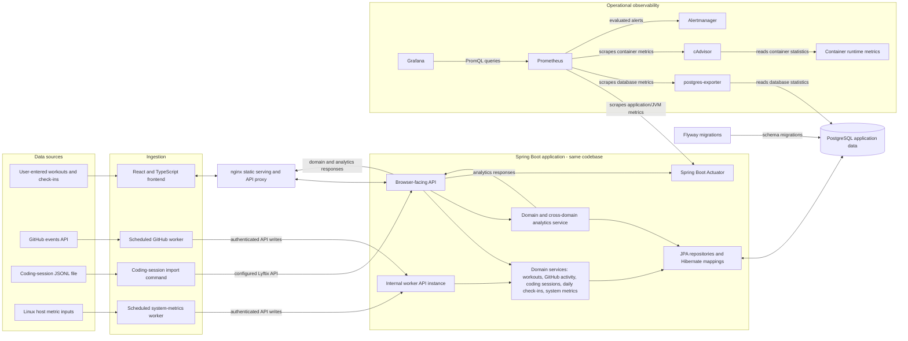

# Application architecture

## Purpose and architectural style

Lyftix is a self-hosted personal analytics platform. It brings manually entered activity, ingested developer activity, daily wellbeing check-ins, and Linux host measurements into one application for history and descriptive analysis.

The core is a **modular monolith**: one Spring Boot codebase owns the application programming interface (API), authentication, domain rules, analytics, and persistence. Controllers, services, repositories, entities, and record-based data transfer objects (DTOs) are separated within that application. In production, the same backend artifact runs as a browser-facing API and as an internal worker API. Those processes do not own independent domains or databases, so their separate containers do not make Lyftix a microservices system. Python ingestion workers and monitoring processes support the core application; neither replaces its domain logic.

## Application and telemetry flows

Arrows show the direction of an interaction: requests, writes, scrapes, or queries. Bidirectional arrows represent request/response or read/write exchanges.

The coding-session command's target is configuration-driven. The diagram shows the browser-facing API as a common API destination, not a fixed routing requirement; the command can use another reachable Lyftix API instance when configured to do so. The scheduled container workers specifically use the internal worker API instance.

## Component responsibilities

| Component | Responsibility |
| --- | --- |
| React/TypeScript frontend | Presents authenticated domain pages, creation forms, histories, key performance indicators (KPIs), charts, and cross-domain comparisons. TanStack Query manages server-state fetching and mutation invalidation. |
| nginx | Serves the built frontend and proxies its API requests to Spring Boot. |
| Spring Boot application | Applies authentication, validation, domain rules, consistent API errors, and read-only analytics; the browser and worker instances execute the same code. |
| Python workers | Collect external or host data, transform it into API requests, and authenticate to Lyftix without owning the database schema. |
| PostgreSQL | Stores users, domain records, audit timestamps, and constraints as durable application data. |
| Flyway | Applies versioned schema migrations before Hibernate mapping validation. |
| Prometheus stack | Collects application, database, and container telemetry independently of the personal-analytics data path. |

## Personal analytics domains

- **Workouts:** user-entered workout type, timing, intensity, and optional calories; history, filtering, summaries, and charts are derived from persisted records.
- **GitHub activity:** ingested events identified by an external ID, with repository and event metadata. A database uniqueness constraint prevents duplicate external IDs.
- **Coding sessions:** timed sessions with project, language, source, and optional notes, currently imported from a JSONL file through a command-line worker.
- **Daily check-ins:** one record per calendar date, including subjective ratings, sleep duration, and optional notes. The database enforces date uniqueness.
- **System metrics:** timestamped CPU, memory, disk, load, and uptime measurements with hostname and source labels. These describe the server environment, not the user's personal activity; they are stored and displayed through Lyftix's domain API.

## Ingestion paths

1. **Browser-created data:** the React frontend sends workout and daily check-in creation requests through nginx to the browser-facing Spring Boot API. The API authenticates, validates, applies domain rules, and persists them.
2. **Scheduled GitHub ingestion:** the GitHub worker fetches and maps GitHub events, posts them to the internal worker API using a session and cross-site request forgery (CSRF) token, and maintains a durable checkpoint for subsequent runs. The backend's unique external-ID constraint remains the final duplicate safeguard.
3. **Coding-session JSONL ingestion:** the import command reads a configured JavaScript Object Notation Lines (JSONL) file, parses sessions, and posts them to its configured Lyftix API URL. There is no automatic integrated development environment (IDE) capture or scheduled coding-session Compose service.
4. **Scheduled host system-metrics ingestion:** the worker reads explicit Linux host `/proc` inputs and a selected host filesystem mount, then posts a sample through the internal worker API. Hostname and collection mode are explicit configuration; the source value is a descriptive stored label.

All four write paths pass through Spring Boot. None of the Python workers connects to or writes PostgreSQL directly.

## Persistence and analytics

Spring Data Java Persistence API (JPA) repositories and Hibernate mappings provide the backend's data-access layer. PostgreSQL is the durable store, while Flyway owns schema evolution through versioned migrations. Hibernate is configured to validate the existing schema rather than generate it. Database constraints—including unique GitHub external IDs and daily check-in dates—provide concurrency-safe integrity guarantees, complemented by API-level validation and error responses.

Domain services provide list, paginated, and filtered views. The analytics service reads persisted domain data and returns workout, GitHub, coding, and check-in summaries plus daily, weekly, and monthly cross-domain results. The frontend consumes these API responses for key performance indicators, trends, and comparisons. Calendar-date analytics use explicit UTC boundaries where instant-based records are involved. These are descriptive aggregations and associations, not causal inference.

## Observability boundary

Lyftix's `system_metrics` records are **application data**: the Python worker collects host measurements, the Spring Boot API persists them, and React displays their history. They are separate from the **operational telemetry** used to assess whether Lyftix and its infrastructure are healthy.

For operational telemetry, Spring Boot Actuator exposes application and Java virtual machine (JVM) measurements; postgres-exporter exposes PostgreSQL measurements; and cAdvisor exposes container measurements. Prometheus scrapes those targets and evaluates alert rules. Grafana queries Prometheus for provisioned backend, PostgreSQL, and container dashboards. Alertmanager receives routed alerts; the checked-in receiver currently discards them rather than sending external notifications. This monitoring path does not populate the Lyftix system-metrics domain table.

## Request and data-flow traces

1. **Creating a workout:** A user submits the React form → nginx proxies the API request → the browser-facing Spring Boot API applies session authentication and CSRF protection → the workout service validates the request and persists it through a JPA repository to PostgreSQL → the API returns the created workout → TanStack Query invalidates affected workout and analytics queries, refetches active data, and updates the UI.
2. **Scheduled GitHub ingestion:** The GitHub Events API → scheduled Python GitHub worker → event mapping and checkpoint logic → worker session authentication and CSRF handling → internal worker API instance → GitHub activity domain validation and persistence through JPA/PostgreSQL → checkpoint advancement only after safe processing. The database's external-ID uniqueness constraint is the final duplicate safeguard.
3. **Cross-domain analytics read:** The React productivity/analytics UI → nginx → browser-facing API → analytics service → persisted domain data through repositories → purpose-built analytics DTO response → TanStack Query and UI visualization. The result is descriptive aggregation and comparison, not causal inference.

## Design rationale

- **One domain-owning application:** the modular monolith keeps related business rules, analytics, security, and transactions in one codebase instead of dividing them into independently deployed domain services.
- **API-mediated ingestion:** workers reuse backend validation, authentication, conflict handling, and schema ownership; direct worker database access would duplicate those responsibilities.
- **Separate worker transport context:** a second instance of the same backend supports normal HTTP-client session cookie behavior for internal workers without changing secure browser-session defaults. It is a transport/deployment boundary, not a separate domain service.
- **Flyway-owned schema:** versioned migrations and Hibernate validation make schema changes explicit; database constraints remain authoritative under concurrent writes.
- **Independent observability:** Prometheus collects infrastructure health separately from personal analytics and can continue monitoring when the application is unavailable.

## Related documentation

The root [README](../../README.md) summarizes capabilities, setup, and deployment. Production ingress, Docker network membership, host publications, and transport trust boundaries are documented in the [production topology](production-topology.md).
