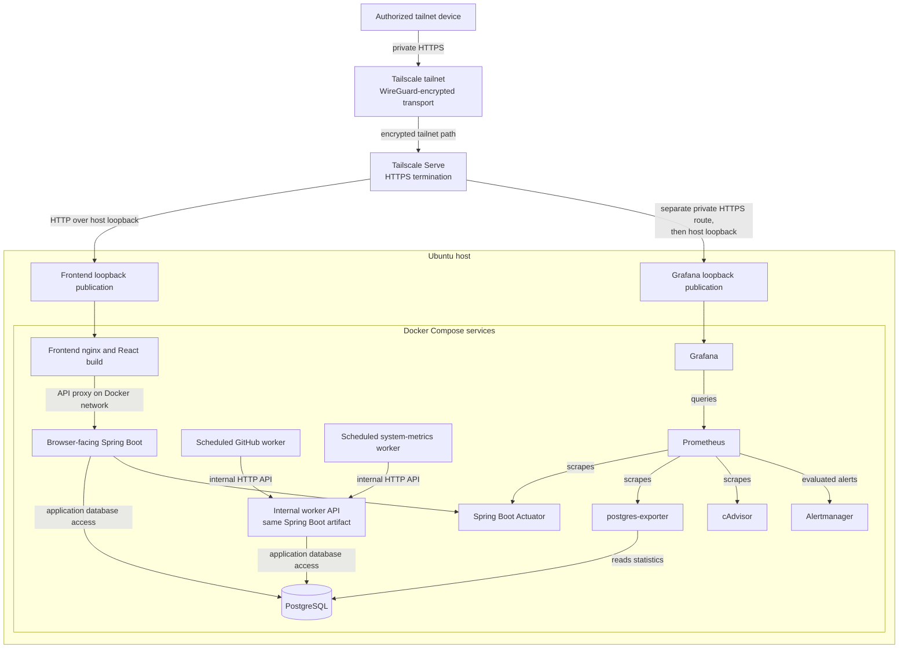

# Production topology

## Purpose and evidence boundary

This document describes Lyftix v1's runtime deployment, ingress, service exposure, persistence, and trust boundaries. For the domain model and software/data flows, see [Application architecture](application-architecture.md).

Container behavior below is defined by [`infrastructure/docker-compose.yml`](../../infrastructure/docker-compose.yml), the [nginx template](../../frontend/nginx.conf.template), and Spring's [production](../../backend/src/main/resources/application-prod.properties) and [base](../../backend/src/main/resources/application.properties) settings. The Ubuntu, Tailscale Serve, firewall, Secure Shell (SSH), and restart observations are host-managed deployment facts supplied for this documentation milestone; those host settings are not stored in this repository.

## Production topology

Only the frontend and Grafana have host publications, both bound to host loopback. The diagram separates the encrypted remote leg, host-loopback forwarding, and Docker service-to-service traffic. It shows containers as deployment processes, not independently owned domain services or a microservices architecture.

## Browser ingress and request trace

An authorized Mac or phone reaches the host over the private Tailscale tailnet. Tailscale uses WireGuard-based encrypted networking; Tailscale Serve provides Hypertext Transfer Protocol Secure (HTTPS) ingress and terminates Transport Layer Security (TLS). Serve forwards the main application route over Hypertext Transfer Protocol (HTTP) to the frontend's loopback-only host publication. nginx serves the compiled React application and proxies `/api/` requests across Docker networking to the browser-facing Spring Boot instance. Spring Boot reaches PostgreSQL when the request needs stored data. The response returns through nginx, Serve, and the encrypted tailnet connection to the browser.

The host-loopback hop is HTTP *after* TLS termination; it does not turn the browser-to-Serve connection into HTTP. The separate Grafana Serve route similarly forwards to Grafana's loopback-only publication. These routes are private tailnet ingress, not Tailscale Funnel or public-internet publication.

## nginx and forwarded-authority trust

The browser-visible authority can differ from nginx's container listener or host publication. Also, because Serve terminates TLS, nginx sees an HTTP request even when the browser used HTTPS. Passing nginx's own scheme or listener port to Spring would misrepresent the browser origin and can cause same-origin or cross-origin resource sharing (CORS) rejection.

The nginx template forwards the incoming `Host` authority, including an external port when present, as both `Host` and `X-Forwarded-Host`. Its `X-Forwarded-Proto` value comes from deployment configuration (`LYFTIX_PUBLIC_SCHEME`, set to `https` by the production Compose service), rather than a hostname guess or a client-supplied forwarding header. It clears incoming `Forwarded` and `X-Forwarded-Port` headers. Spring uses `server.forward-headers-strategy=framework` to reconstruct the external request for same-origin, CORS, and cross-site request forgery (CSRF) behavior. This design depends on the intended Serve-to-loopback ingress boundary; it is not a license to trust arbitrary direct clients' forwarding headers.

## Browser authentication and session boundary

Spring Security authenticates against application users and establishes server-side sessions. The `JSESSIONID` cookie is the possession-based session identifier: a party holding a valid cookie can present that session, so its transport and handling matter. Production browser sessions default to `Secure`, `HttpOnly`, and `SameSite=Lax`. `Secure` tells the browser not to send that cookie on non-HTTPS requests; it does not itself encrypt a request. HTTPS protects the browser-to-Serve leg. `HttpOnly` keeps the session cookie out of browser JavaScript.

State-changing requests retain cookie-based CSRF protection, and CORS is restricted to explicitly configured credentialed origins. The frontend obtains a CSRF token and sends the required header; disabling CSRF or allowing wildcard origins is not part of this topology.

## Worker authentication and session boundary

The scheduled GitHub and system-metrics workers call `worker-api` over private Docker HTTP. It is not host-published. They authenticate using ordinary `httpx` cookie handling, a server-side session, and CSRF tokens. Normal HTTP clients will not send a `Secure` cookie over HTTP, so this second instance deliberately sets `LYFTIX_SESSION_COOKIE_SECURE=false`. The browser-facing backend retains its production Secure-cookie default. Both instances run the same Spring Boot artifact and use the same PostgreSQL application database; the second instance is a transport boundary, not an unauthenticated shortcut or a separate domain service.

## Docker service exposure

| Compose service | Role and host exposure |
| --- | --- |
| `frontend` | React/nginx ingress; loopback host-published only. |
| `grafana` | Operational dashboards; separate loopback host publication and private Serve route. |
| `backend` | Browser-facing API; internal-only, no host-published port. |
| `worker-api` | API for scheduled workers; internal-only, no host-published port. |
| `postgres` | Application database; internal-only, no host-published port. |
| `github-worker` | Scheduled ingestion with outbound GitHub access; no host-published port. |
| `system-metrics-worker` | Scheduled host-metric ingestion; no host-published port. |
| `prometheus` | Telemetry collection and rules; internal-only. |
| `alertmanager` | Receives evaluated alerts; internal-only. |
| `postgres-exporter` | PostgreSQL telemetry; internal-only. |
| `cadvisor` | Container telemetry; internal-only. |

## Docker network boundaries

Compose's implicit `default` network joins `frontend`, `backend`, `postgres`, `prometheus`, `grafana`, `alertmanager`, `postgres-exporter`, and `cadvisor`. `postgres` additionally joins `worker_db`, marked `internal: true`. `worker-api` joins `worker_api` and `worker_db`, but not `default`. Both scheduled workers join only `worker_api`; they do not join either database network. `worker_api` is not marked internal, and the GitHub worker is attached to it. The worker calls the GitHub API and therefore requires outbound connectivity; unlike `worker_db`, this network's Compose configuration does not impose Docker's internal-network egress restriction.

Network separation limits direct routes, but private Docker networking is not authentication. Workers still authenticate to the API and cannot directly write PostgreSQL. The Spring Boot application remains the owner of validation, business rules, and Flyway-managed schema changes.

## Observability topology

Prometheus pulls Spring Boot Actuator metrics from the browser-facing backend, PostgreSQL metrics from `postgres-exporter`, and container metrics from cAdvisor. Grafana queries Prometheus using its provisioned internal data source. Prometheus evaluates checked-in alert rules and sends resulting alerts to Alertmanager. The checked-in Alertmanager receiver is `discard`; external notification delivery is not configured here.

Grafana alone has a deliberate private remote route through Serve and its loopback publication. Prometheus, Alertmanager, postgres-exporter, cAdvisor, and the Actuator-bearing backend are not host-published. This telemetry path is distinct from host-system metrics stored as Lyftix application records.

## Host security boundary

The deployment runs on Ubuntu Linux on a repurposed HP laptop. The supplied host configuration has Uncomplicated Firewall (UFW) active with deny-incoming and allow-outgoing defaults, with SSH allowed. SSH requires public-key authentication; password and keyboard-interactive authentication and root login are disabled. No router port forwarding is configured for Lyftix or SSH. Remote application access is through authorized tailnet devices and Tailscale Serve, not the public internet or Tailscale Funnel.

UFW alone is not assumed to police Docker-published ports: Docker's networking and firewall rules are a separate concern. The Compose publications were explicitly restricted to loopback, and internal services have no host publications. Docker daemon access is highly privileged; cAdvisor's read-only Docker/containerd socket and host mounts still cross a sensitive host-observation boundary and should be treated accordingly. This document does not claim that those controls remove all host or container risk.

## Persistence and restart characteristics

Compose defines named volumes for PostgreSQL data, Prometheus data, Grafana data, Alertmanager data, and GitHub worker checkpoint state. The services use `restart: unless-stopped`; PostgreSQL has a health check, and both backend instances wait for database readiness. Prometheus does not wait for backend health, allowing it to observe backend downtime.

Deployment verification supplied for this milestone reports that PostgreSQL data survived container recreation and services recovered after a Docker daemon restart. Those observations do **not** establish full unattended physical-host reboot recovery. That has not been validated because of a separate HP Unified Extensible Firmware Interface (UEFI) boot issue. No backup system is represented as implemented here.

## Trust boundaries and threat model

| Boundary | Trusted route or control | Remaining consideration |
| --- | --- | --- |
| Public internet | No router port forwarding or public Lyftix ingress is configured. | Internet exposure must not be inferred from a private Serve route. |
| Authorized tailnet device | Tailnet membership permits reaching private Serve ingress. | Device/user authorization and browser session authentication are separate checks. |
| Tailscale Serve and host | Serve terminates HTTPS and forwards to loopback. | The host and ingress configuration are trusted deployment components. |
| Browser-facing nginx/backend | nginx preserves browser authority; Spring enforces sessions, CSRF, and explicit CORS origins. | Browser possession of a valid session cookie grants that session's access. |
| Internal worker network | Workers reach an internal API over HTTP and still authenticate with session and CSRF. | Network isolation alone is not an authentication mechanism. |
| Database networks | Backend instances access PostgreSQL; worker processes do not. | Database credentials and host/container administration remain sensitive. |
| Observability components | Grafana is private-ingress only; other telemetry services are internal-only. | Telemetry and socket/host mounts can reveal operational details. |
| Docker host administration | Docker daemon and host administrators control containers and mounts. | This is effectively a root-equivalent trust boundary, not a low-privilege user role. |

## Exposure summary

Lyftix can be reached remotely without publishing its application or database ports to the public internet. Authorized tailnet connectivity, deliberate private Tailscale Serve routes, and loopback-only frontend/Grafana publications provide the remote path; backend and infrastructure services remain internal.

## Relationship to application architecture

This document covers where processes run and how requests cross ingress and trust boundaries. [Application architecture](application-architecture.md) covers domain ownership, ingestion, persistence, analytics, and the separation of personal data from operational telemetry.
