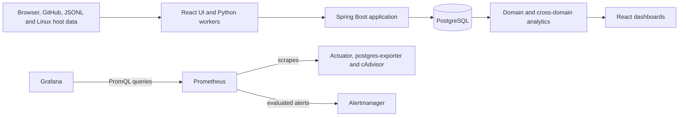

# Lyftix: engineering a self-hosted personal analytics platform

## Project overview

I built Lyftix to replace disconnected workout, development, wellbeing, and server logs with one private system for collecting and exploring personal data. The application supports workouts, GitHub activity, coding sessions, daily check-ins, and Linux host metrics. It also produces daily, weekly, monthly, and productivity-oriented summaries across those domains.

Lyftix is designed for descriptive analysis. It can show that two trends coincide, but it does not claim that one caused the other. Version 1 is documented as running in a private self-hosted environment; it is not a public software-as-a-service product.

## Architecture

The core backend is a Spring Boot modular monolith. One application owns authentication, domain rules, analytics, persistence, and API error handling. Controllers, services, repositories, entities, and record-based data transfer objects remain separated by responsibility, but I deliberately avoided dividing a single-user product into distributed domain services. This keeps transactions and operational ownership straightforward while retaining internal modularity.

The React and TypeScript frontend is built with Vite, served by nginx, and uses TanStack Query for fetching, caching, mutations, and targeted invalidation. PostgreSQL is the durable store. Flyway owns schema evolution, while Hibernate validates the migrated schema instead of generating it.

Python workers ingest GitHub events and host measurements on schedules and import coding sessions from JSON Lines on demand. They write through the authenticated Spring API rather than accessing PostgreSQL directly. That choice centralizes validation, conflict handling, and schema ownership.

Component and request flows are available in the [application architecture](../architecture/application-architecture.md). The [production topology](../architecture/production-topology.md) documents ingress, Docker networking, persistence, and trust boundaries separately.

## Engineering challenges and trade-offs

### Browser and worker authentication boundaries

Production browsers need Secure session cookies over HTTPS. Scheduled workers communicate with the backend over private Docker HTTP, where a standards-compliant client will not send a Secure cookie. Manually overriding cookie headers would undermine normal HTTP client behaviour.

I kept the browser-facing backend's Secure-cookie default and ran the same Spring Boot artifact as a second, non-host-published `worker-api` process. Only that internal transport context uses a non-Secure session cookie. Workers still authenticate normally with `httpx`, retain CSRF protection, and cannot reach PostgreSQL directly. This costs an additional backend process, but avoids weakening browser security or introducing a second authentication system solely for deployment convenience.

### Recoverable GitHub ingestion

GitHub ingestion must tolerate pagination, unsupported events, duplicates, partial failures, and restarts. The worker maps supported events and stores its checkpoint in persistent container state. Checkpoint updates use a temporary file, `fsync`, and atomic replacement. A checkpoint advances only after safe processing and only when the previous checkpoint or end of available history was reached.

The backend database uniqueness constraint on GitHub external IDs remains the final concurrency-safe duplicate safeguard. A recognised violation becomes an HTTP 409 response instead of an unexpected server error. This combines application-level recovery with database-level integrity rather than relying on a race-prone check-before-insert query.

### Host-aware metrics from a container

Ordinary process metrics inside a container can mix container and host namespaces. To represent the actual Linux host deliberately, the production worker uses an explicit host collection mode and configured hostname. It reads narrowly mounted, read-only `/proc/stat`, `/proc/meminfo`, `/proc/loadavg`, and `/proc/uptime` inputs. Disk capacity comes from a dedicated directory on the host filesystem rather than the container root.

CPU utilisation is calculated from consecutive aggregate `/proc/stat` samples. The worker remains non-root and does not require privileged mode, the host PID namespace, a complete host-root mount, or Docker socket access. The trade-off is Linux-specific deployment configuration in exchange for measurements with explicit provenance.

### Database integrity and temporal filtering

Inclusive calendar end dates are easy to implement incorrectly because JavaScript dates, Java instants, and PostgreSQL timestamps support different precision. Lyftix converts calendar ranges to start-inclusive/end-exclusive UTC instants and queries with `timestamp >= start AND timestamp < next-day midnight`. This includes the complete selected end date without admitting the following day.

Service validation rejects invalid time ranges, while Flyway migrations define authoritative constraints such as unique GitHub external IDs and one daily check-in per date. The result is layered validation: responsive client feedback, deliberate API errors, and database protection under concurrent writes.

## Security and production deployment

Spring Security authenticates database-backed users with a delegating password encoder and server-side sessions. Session fixation protection is enabled. Browser cookies are `HttpOnly`, `SameSite=Lax`, and Secure by default in production. State-changing requests require cookie-based CSRF protection, and credentialed cross-origin resource sharing is restricted to configured origins.

The repository defines a Docker Compose topology containing the frontend, browser backend, worker API, PostgreSQL, scheduled workers, and monitoring services. Only nginx and Grafana have host publications, both bound to loopback. Other application and telemetry services remain internal to Docker networking. Runtime credentials come from ignored environment or secret files, and the application images use non-root runtime users.

Compose and nginx verify those repository-defined properties. The documentation additionally records operational deployment on an Ubuntu host, private HTTPS ingress through Tailscale Serve, firewall and Secure Shell configuration, and observed restart behaviour. Those host-managed facts are documented operational evidence rather than configuration enforced by this repository. GitHub Actions validates the project but does not deploy it.

## Testing, CI, and observability

Backend unit tests isolate business rules with JUnit and Mockito. Integration tests start a real Testcontainers PostgreSQL instance, apply Flyway migrations, retain `ddl-auto=validate`, and exercise persistence, constraints, authentication, CSRF, analytics, OpenAPI, logging, and API errors. Frontend tests use Vitest and Testing Library for auth boundaries, forms, routing, query behaviour, date handling, and dashboards. Pytest covers worker configuration, authentication, clients, mapping, checkpoint recovery, scheduling, and host `/proc` parsing. Infrastructure regression tests inspect Compose and nginx security-sensitive configuration.

Continuous integration has five independent jobs: backend, frontend, workers, infrastructure, and container builds. It runs tests and linters, validates default and worker-profile Compose configurations with synthetic settings, and builds all three application images without publishing them.

Operational telemetry remains separate from Lyftix's stored system-metrics domain. Prometheus scrapes Spring Boot Actuator, postgres-exporter, and cAdvisor. Provisioned Grafana dashboards cover backend/JVM/HTTP behaviour, PostgreSQL, and containers. Prometheus evaluates availability and resource alerts and sends them to Alertmanager; the checked-in receiver intentionally discards alerts, so external notifications are not currently implemented.

## Outcomes and limitations

Lyftix demonstrates a complete engineering path: multiple persisted domains, cross-domain analytics, versioned schema evolution, secure browser and worker sessions, recoverable ingestion, responsive dashboards, non-root containers, private ingress, layered automated tests, and provisioned observability. These are implementation outcomes, not claims about traffic scale, uptime, or business impact.

The current system remains intentionally single-owner. It has no account-recovery workflow, coding sessions require JSONL import rather than automatic capture, and Alertmanager has no external receiver. The deployment is private and not highly available. Future work may include a deliberately designed coding capture integration, user-management and recovery workflows if the ownership model expands, wearable data sources, and storage-health telemetry.
